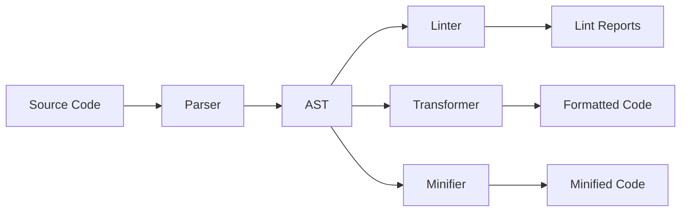

# Getting Started

## What is Oxc?

The JavaScript Oxidation Compiler (Oxc) is a collection of high-performance tools for the JavaScript language written in Rust. Think of it as a **unified JavaScript toolchain** that provides all the essential tools you need for modern JavaScript development in a single, fast package.

### Why Oxc?

**🚀 Blazing Fast Performance**
- **50-100x faster** than ESLint for linting
- **3x faster** than SWC for parsing  
- **28x faster** than enhanced-resolve for module resolution

**🔧 Drop-in Replacements**
- Compatible with ESLint, Prettier, Babel, and SWC configurations
- Smooth migration path from existing tools
- No need to rewrite your build processes

**🛠️ Unified Toolchain**
- All tools share the same AST and infrastructure
- Consistent APIs and configuration
- Better integration between tools

## Quick Start

Choose your path based on what you want to do:

### 👨‍💻 I want to try Oxc tools in my project

**Start with oxlint (our most mature tool):**

```bash
# Try it instantly - no installation needed
npx oxlint@latest

# Or install globally
npm install -g oxlint

# Lint your project
oxlint src/
```

**Replace ESLint in CI for faster feedback:**
```bash
# Before ESLint in your CI
oxlint src/ && eslint src/
```

→ [**Linter Usage Guide**](/docs/guide/usage/linter.html)

### 🔄 I want to migrate from existing tools

- **From ESLint**: Use our [eslint-plugin-oxlint](https://www.npmjs.com/package/eslint-plugin-oxlint) to gradually migrate
- **From SWC**: Drop-in replacement for parsing and transformation
- **From Prettier**: Try our formatter (coming soon)

→ [**Migration Guides**](#migration-guides)

### 🏗️ I'm building JavaScript tools

Use Oxc as the foundation for your tooling:

```rust
// Parse JavaScript/TypeScript with full AST
use oxc_parser::Parser;
use oxc_ast::Visit;

// Build on top of our infrastructure
```

→ [**Learn Architecture**](/docs/learn/parser_in_rust/intro.html)

### 🤝 I want to contribute

Join our growing community of contributors:

```bash
# Clone and build
git clone https://github.com/oxc-project/oxc.git
cd oxc
cargo build
```

→ [**Contribution Guide**](/docs/contribute/introduction.html)

## What's Available Now

| Tool | Status | Description | Speed Improvement |
|------|--------|-------------|-------------------|
| **Linter** | ✅ Production Ready | 570+ rules, ESLint compatible | 50-100x faster than ESLint |
| **Parser** | ✅ Production Ready | Full Test262 compliance | 3x faster than SWC |
| **Transformer** | ✅ Production Ready | TypeScript, JSX, Babel compatible | 2-3x faster than SWC |
| **Resolver** | ✅ Production Ready | Module resolution | 28x faster than enhanced-resolve |
| **Minifier** | 🚧 Alpha | Size-focused minification | Faster than Terser |
| **Formatter** | 🚧 Development | Prettier compatible | Coming Q1 2025 |

## How the Tools Work Together



All Oxc tools share the same high-performance parser and AST, enabling:
- **Faster processing** - Parse once, use everywhere
- **Better consistency** - Same understanding of your code across tools
- **Lower memory usage** - Shared data structures

## Installation & Setup

### Single Tool Installation

```bash
# Linter only
npm install -g oxlint

# Parser for Node.js projects  
npm install oxc-parser

# Transform runner
npm install oxc-transform
```

### Project Integration

Add to your `package.json`:

```json
{
  "scripts": {
    "lint": "oxlint src/",
    "lint:fix": "oxlint src/ --fix"
  },
  "devDependencies": {
    "oxlint": "^0.20.0"
  }
}
```

### CI/CD Integration

```yaml
# GitHub Actions
- name: Lint with Oxlint
  run: npx oxlint@latest --deny-warnings src/
```

## Migration Guides

### From ESLint

Use our plugin to gradually migrate:

```bash
npm install eslint-plugin-oxlint --save-dev
```

```js
// eslint.config.js
import oxlint from 'eslint-plugin-oxlint';

export default [
  oxlint.configs.recommended, // Turn off ESLint rules handled by oxlint
  // ... your existing config
];
```

### From SWC

Replace SWC with Oxc transform:

```js
// Before: SWC
import { transformSync } from '@swc/core';

// After: Oxc  
import { transformSync } from 'oxc-transform';
```

## Real-World Success Stories

### Shopify - 75 minutes → 10 seconds

**[Jason Miller](https://github.com/developit), creator of [Preact](https://preactjs.com):**

> oxlint has been a massive win for us at Shopify. Our previous linting setup took 75 minutes to run, so we were fanning it out across 40+ workers in CI.
>
> By comparison, oxlint takes around 10 seconds to lint the same codebase on a single worker, and the output is easier to interpret.
>
> We even caught a few bugs that were hidden or skipped by our old setup when we migrated!

### Vue.js - Sub-50ms linting

**[Evan You](https://x.com/youyuxi/status/1734439543280128030), creator of [Vue.js](https://vuejs.org) and [Vite](https://vitejs.dev):**

> Ran oxlint on the Vue 3 codebase, ~200 rules + ~590 files finished in 50ms 🤯 (30ms re-runs)
>
> The performance is absolutely nuts

## Industry Recognition

**[Eric Simons](https://x.com/ericsimons40/status/1766525300584947999), CEO of [StackBlitz](https://stackblitz.com/):**
> Oxc is slept on rn. Most JS/TS toolchains will be using it within the next few yrs imo

**[Miles Johnson](https://x.com/mileswjohnson/status/1734698340791800283), creator of [Moonrepo](https://moonrepo.dev):**
> It's crazy how good oxlint (and oxc tools) is. Not just in performance, but ease of use. Banking on Rust was a good choice!

**[Luke Edwards](https://x.com/lukeed05/status/1829527267162345651):**
> For a while now, @boshen_c has been crushing it, setting the foundation for the next generation of JS tooling.

**[Yagiz Nizipli](https://github.com/sponsors/anonrig), founder of [Node.js performance team](https://github.com/nodejs/performance):**
> I'm impressed by how oxc is actively encouraging JavaScript tools to improve their performance.

**[Joe Savona](https://x.com/en_JS/status/1676467920334094336), [React](https://react.dev) team member:**
> For…reasons I am experimenting w various Rust-based JS compilers. I don't agree w every design decision but overall oxc is really well done.

## Next Steps

Ready to dive deeper? Here's where to go based on your interests:

### 🚀 Start Using Oxc
- **[Linter Guide](/docs/guide/usage/linter.html)** - Replace ESLint with oxlint
- **[Parser Guide](/docs/guide/usage/parser.html)** - Use our JavaScript/TypeScript parser
- **[All Tools](/docs/guide/usage/)** - Explore all available tools

### 📚 Learn How It Works  
- **[Architecture Overview](/docs/learn/architecture/)** - Understand how Oxc is built
- **[Parser in Rust Tutorial](/docs/learn/parser_in_rust/intro.html)** - Learn JavaScript parser construction
- **[Performance Details](/docs/learn/performance.html)** - Deep dive into our optimizations

### 🤝 Join the Community
- **[Contributing Guide](/docs/contribute/introduction.html)** - Help build the future of JS tooling
- **[Discord Community](https://discord.gg/9uXCAwqQZW)** - Chat with the team and community
- **[GitHub Repo](https://github.com/oxc-project/oxc)** - Browse the source code

## Our Mission

Our goal is to empower the [next generation toolchain for JavaScript](https://voidzero.dev/posts/announcing-voidzero-inc) as part of [VoidZero](https://voidzero.dev). We believe that JavaScript tooling should be:

- **Fast by default** - No waiting for builds or linting
- **Easy to adopt** - Drop-in replacements for existing tools
- **Reliable** - Comprehensive testing and real-world validation
- **Future-focused** - Built for the evolving JavaScript ecosystem

## Special Thanks

- [Biome][biome] and [Ruff][ruff]: This project would not exist without the help, inspiration, and encouragement from these two projects, who are pioneers in the field of Rust-based unified toolchains.
- [quick-lint-js][quick-lint-js] and [elm-review][elm-review]: For educating how static analysis could be improved in both performance and usability.

[biome]: https://biomejs.dev
[ruff]: https://beta.ruff.rs
[quick-lint-js]: https://quick-lint-js.com/
[elm-review]: https://package.elm-lang.org/packages/jfmengels/elm-review/latest/